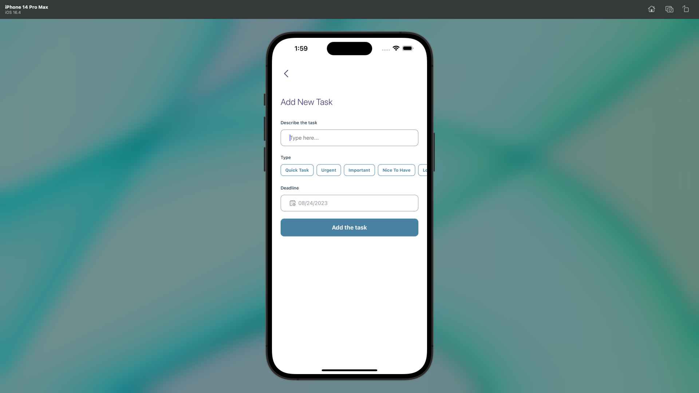

# Project Name: Planify

## Overview

Welcome to the Planify! This is a mobile application developed using React Native CLI. The app allows users to log in, create tasks of different priorities, mark them as completed, and delete them.

## Prerequisites

-   Node.js version >= 16
-   npm or yarn

## Installation

1. Clone the repository: `git clone https://github.com/your-username/ReactNativeCLI-TaskManager.git`
2. Navigate to the project directory: `cd ReactNativeCLI`
3. Install dependencies: `npm install` or `yarn install`

## Available Scripts

In the project directory, you can run the following scripts:

-   `npm run android`: Runs the app on an Android emulator or connected device.
-   `npm run ios`: Runs the app on an iOS simulator or connected device.
-   `npm run lint`: Lints the project files using ESLint.
-   `npm start`: Starts the Metro Bundler.
-   `npm test`: Runs the test suite using Jest.
-   `npm run lint:ts`: Lints TypeScript files using ESLint.
-   `npm run lint:ts:fix`: Lints and automatically fixes TypeScript files.

## Technologies Used

This project leverages the following key technologies:

-   **React Native CLI**
-   **React Navigation** for navigation and routing
-   **Redux Toolkit** for state management
-   **Firebase** for authentication and data storage
-   **Moment.js** for handling dates and times
-   **TypeScript** for type-safe JavaScript
-   **ESLint** and **Prettier** for code linting and formatting
-   **Jest** for testing

## Login Details

You can use the following login details to access the app:

-   Email: example@example.com
-   Password: example123

## Usage

1. Make sure you have the required dependencies installed.
2. Run the app on your desired platform using the available scripts.
3. Log in or create an account.
4. Create tasks with different priorities.
5. Mark tasks as completed and delete them as needed.

## Screenshots

Here are a few screenshots from the app:

